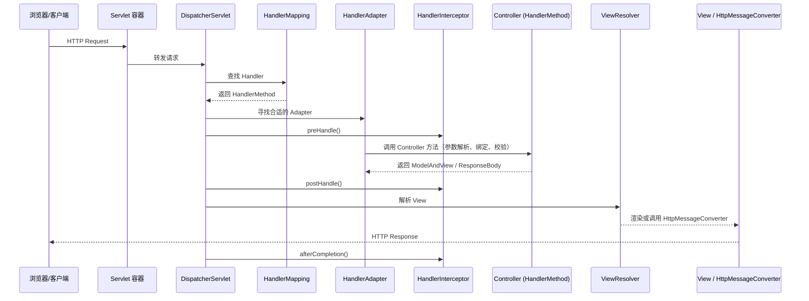

# Spring Web 核心类与处理流程示意

本文档整理了 Spring Web（Spring MVC）中常见的核心类、接口与它们的职责，并给出一个简洁的请求处理流程示意图（Mermaid），方便理解各组件的协作关系。

------

# 一、核心包与典型类/接口（按职责分组）

## 1. Servlet 层

- `javax.servlet.Servlet` / `javax.servlet.Filter`（容器接口）
- `org.springframework.web.servlet.DispatcherServlet`：整个 Spring MVC 的入口，前端控制器（Front Controller）。

## 2. 请求映射与处理链

- `org.springframework.web.servlet.HandlerMapping`（接口）
  - 常见实现：`RequestMappingHandlerMapping`（基于注解的映射）
- `org.springframework.web.servlet.HandlerAdapter`（接口）
  - 常见实现：`RequestMappingHandlerAdapter`（将 HandlerMethod 封装为可执行单位）
- `org.springframework.web.method.HandlerMethod`：方法级处理器封装（Controller 方法）

## 3. 控制器相关

- `org.springframework.stereotype.Controller` / `org.springframework.web.bind.annotation.RestController`（注解）
- `org.springframework.web.bind.annotation.RequestMapping` 等请求映射注解
- `org.springframework.web.bind.WebDataBinder` / `@InitBinder`：数据绑定与类型转换
- `org.springframework.web.bind.annotation.ModelAttribute`：模型属性处理

## 4. 拦截器与切面

- `org.springframework.web.servlet.HandlerInterceptor`：执行链拦截点（preHandle/postHandle/afterCompletion）
- `org.springframework.web.servlet.mvc.method.annotation.ResponseBodyAdvice`：响应前处理

## 5. 异常处理与控制器增强

- `org.springframework.web.servlet.HandlerExceptionResolver`（接口）
  - 常见实现：`ExceptionHandlerExceptionResolver`（支持 `@ExceptionHandler`）、`ResponseStatusExceptionResolver`、`DefaultHandlerExceptionResolver`
- `@ControllerAdvice`：全局异常处理、全局数据绑定、全局模型属性

## 6. 视图解析与渲染

- `org.springframework.web.servlet.ViewResolver`（接口）
  - 常见实现：`InternalResourceViewResolver`、`ThymeleafViewResolver`、`BeanNameViewResolver`
- `org.springframework.web.servlet.View`：渲染接口
- `org.springframework.web.servlet.ModelAndView`：控制器返回模型与视图

## 7. 消息转换与 REST 支持

- `org.springframework.http.converter.HttpMessageConverter`（接口）
  - 常见实现：`MappingJackson2HttpMessageConverter`（JSON）、`StringHttpMessageConverter`
- `org.springframework.http.ResponseEntity`／`@ResponseBody` 支持

## 8. 静态资源与上传

- `org.springframework.web.servlet.resource.ResourceHttpRequestHandler`：静态资源处理
- `org.springframework.web.multipart.MultipartResolver`：文件上传支持（如 `StandardServletMultipartResolver`）

## 9. 配置与扩展点

- `org.springframework.web.servlet.config.annotation.WebMvcConfigurer`：自定义 MVC 配置（注册拦截器、资源处理、消息转换器等）
- `org.springframework.web.servlet.config.annotation.EnableWebMvc`：启用 MVC 默认配置（注意与 Spring Boot 自动配置的区别）

------

# 二、请求处理流程（简化）

1. 客户端发起 HTTP 请求，容器（Servlet 容器）将请求交给 `DispatcherServlet`。
2. `DispatcherServlet` 根据配置按顺序询问 `HandlerMapping` 找到合适的 `Handler`（通常是 `HandlerMethod`）。
3. 找到 `Handler` 后，`DispatcherServlet` 选择对应的 `HandlerAdapter` 来执行该 `Handler`。
4. 在执行前，`HandlerInterceptor` 的 `preHandle` 被调用（若有）。
5. `HandlerAdapter` 调用 Controller 的方法，执行参数解析（`HandlerMethodArgumentResolver`）、数据绑定、`@InitBinder`、校验等。
6. Controller 返回 `ModelAndView` 或 `@ResponseBody` 的结果。
7. `postHandle`（拦截器）被调用；若有异常则进入 `HandlerExceptionResolver` 处理流。
8. `ViewResolver` 根据视图名解析 `View` 并渲染；若是 `@ResponseBody`/REST 则通过 `HttpMessageConverter` 将对象写回响应体。
9. `afterCompletion`（拦截器）被调用，完成一次请求生命周期。

------

# 三、简洁示意图（Mermaid - Sequence）



> 说明：上图为典型同步请求流程，实际框架中还有诸如异步请求（`Callable`、`DeferredResult`、`WebAsyncManager`）、过滤器链、静态资源优先级、拦截器链顺序和异常处理器的复杂互动。

------

# 四、常见类之间的关系图（简化 ASCII）

```
Client --> Servlet Container
             |
             v
       DispatcherServlet
       /      |        \
  HandlerMapping  HandlerExceptionResolver  ResourceHttpRequestHandler
       |                   |
       v                   v
   HandlerMethod <--> HandlerAdapter
       |
   Controller (method)
       |
   returns ModelAndView / @ResponseBody
       |
   ViewResolver -> View / HttpMessageConverter -> Response
```

------

# 五、快速参考（按类名索引）

- `DispatcherServlet`：入口
- `HandlerMapping`：映射 URL -> Handler
- `HandlerAdapter`：执行 Handler
- `HandlerInterceptor`：拦截器
- `Controller` / `@Controller`：处理请求
- `RequestMappingHandlerMapping` / `RequestMappingHandlerAdapter`：注解驱动实现
- `ViewResolver` / `View`：视图解析与渲染
- `HttpMessageConverter`：请求/响应体（序列化/反序列化）
- `HandlerExceptionResolver`：异常处理
- `WebMvcConfigurer`：自定义配置点

------

# 六、进阶提示与调试要点

- 开启 DEBUG 日志（`org.springframework.web`）可以看到 `HandlerMapping` 与 `HandlerAdapter` 的决策过程。
- 使用 `WebMvcConfigurer` 注入自定义 `HandlerInterceptor`、`MessageConverter`、`ArgumentResolver` 来扩展默认行为。
- 在 Spring Boot 中，许多组件由自动配置提供，查看 `WebMvcAutoConfiguration` 有助于理解默认 bean 的装配顺序。

------

如果你需要：

- 我可以把这份内容导出为 PDF、PNG 图片（带矢量图或 Mermaid 渲染），或把 mermaid 图改为更详细的序列/时序或组件拓扑布局。
- 或者我可以把类关系画成 PlantUML 格式并生成 PNG（如果你希望我直接生成文件，请说明需要的格式）。